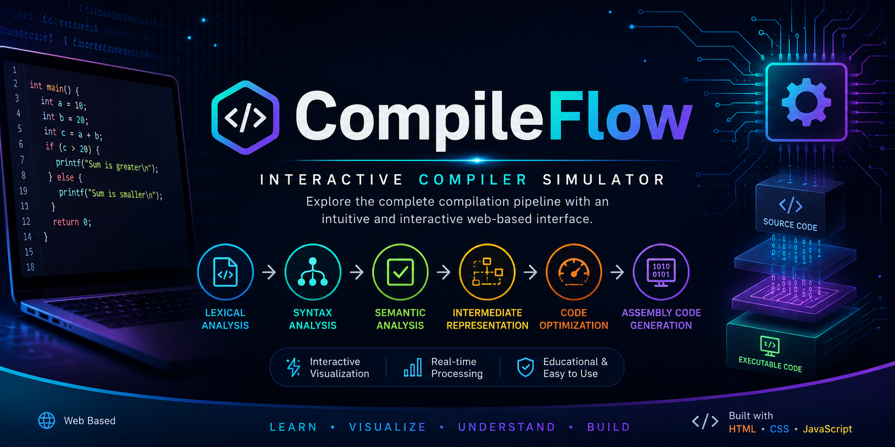
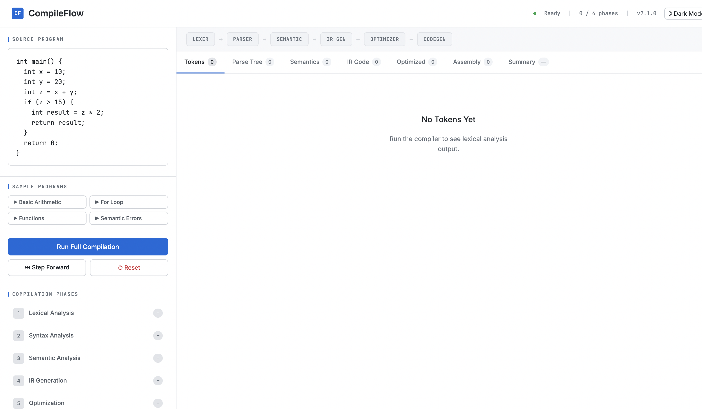
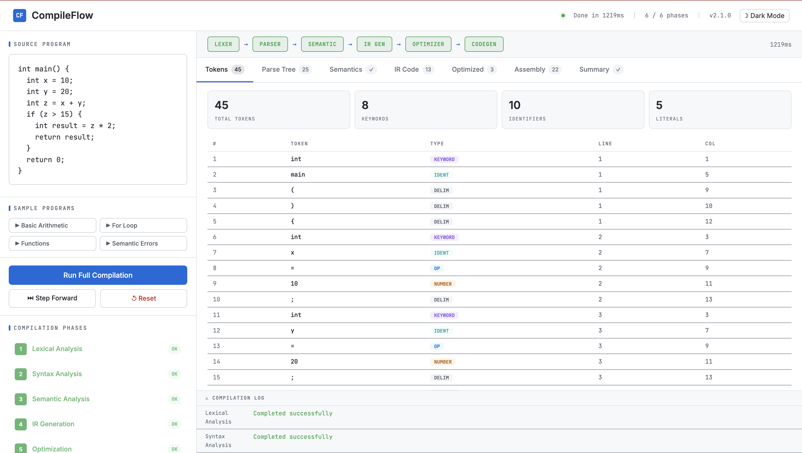
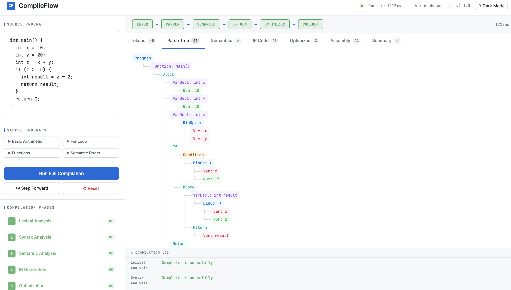
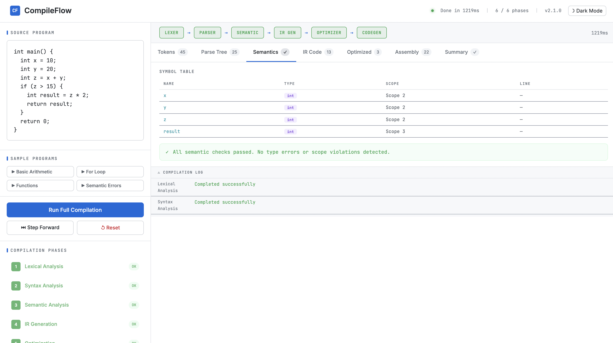
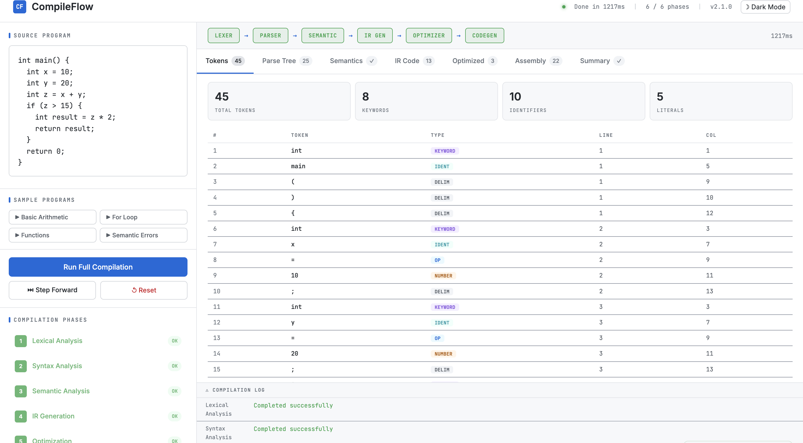
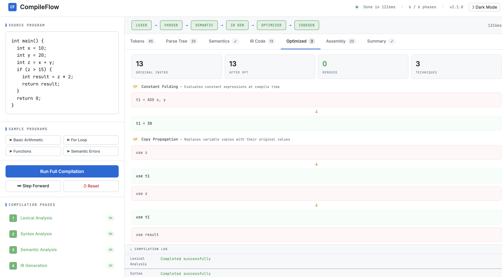
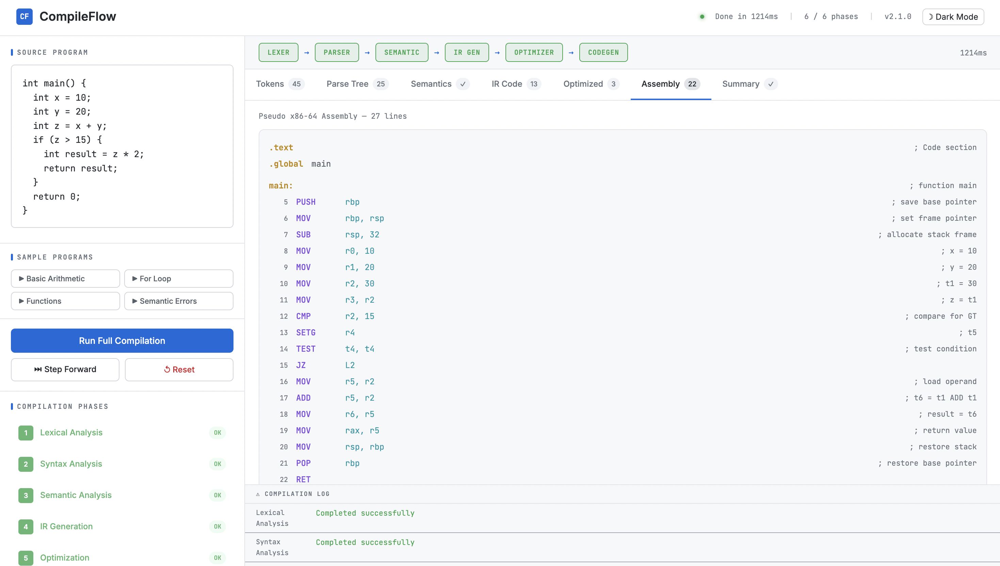
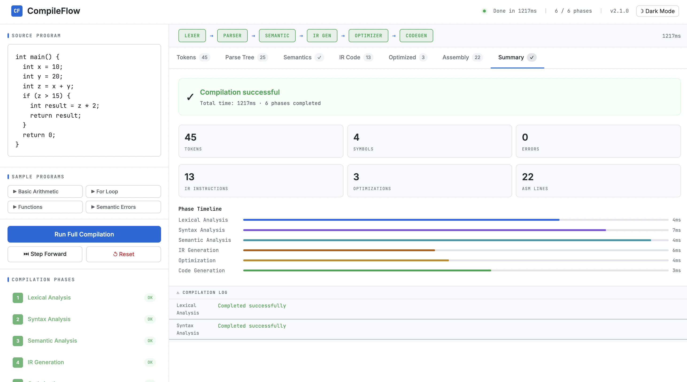

<p align="center">
  
</p>

<h1 align="center">🚀 CompileFlow</h1>

<p align="center">
  <strong>An Interactive Web-Based Compiler Simulator</strong>
</p>

<p align="center">
Visualize the complete compiler pipeline from lexical analysis to assembly code generation through an intuitive, interactive, and educational web application.
</p>

<p align="center">


</p>

---

# 📖 About

CompileFlow is a modern **Compiler Construction Simulator** developed using **HTML, CSS, and JavaScript**. It enables students, educators, and developers to understand how a compiler transforms source code into executable instructions through an interactive visual workflow.

Instead of simply displaying compiler theory, CompileFlow demonstrates each compilation stage with real-time outputs, making compiler concepts easier to understand and learn.

---

# ✨ Features

| Feature | Description |
|----------|-------------|
| 🔍 Lexical Analysis | Generates tokens from source code |
| 🌳 Syntax Analysis | Performs parsing and grammar validation |
| ✅ Semantic Analysis | Checks variables, scope, and data types |
| ⚡ Intermediate Representation | Generates Three Address Code (TAC) |
| 🚀 Code Optimization | Demonstrates optimization techniques |
| 🖥 Assembly Generation | Produces simplified assembly instructions |
| 📊 Compilation Statistics | Displays execution metrics |
| 📋 Compilation Summary | Complete overview of all compilation phases |
| ▶ Step-by-Step Mode | Execute compiler phases individually |
| ⚡ Full Compilation | Run the entire compiler pipeline |
| 📚 Sample Programs | Built-in examples for quick testing |
| 📱 Responsive Design | Works across desktop and mobile devices |

---

# 🛠 Technologies Used

| Technology | Purpose |
|------------|---------|
| HTML5 | Structure |
| CSS3 | Styling & Responsive UI |
| JavaScript (ES6) | Compiler Logic & Interactivity |

---

# 📂 Project Structure

```text
CompileFlow
│
├── images/
│   ├── banner.png
│   ├── home.png
│   ├── lexer.png
│   ├── parser.png
│   ├── semantic.png
│   ├── ir-generation.png
│   ├── optimization.png
│   ├── assembly.png
│   └── summary.png
│
├── index.html
├── styles.css
├── script.js
├── README.md
└── .gitignore
```

---

# ⚙ Compiler Pipeline

## 1️⃣ Lexical Analysis

- Token Generation
- Keyword Detection
- Identifier Recognition
- Operators
- Delimiters
- Literals

---

## 2️⃣ Syntax Analysis

- Parser
- Parse Tree Generation
- Grammar Validation

---

## 3️⃣ Semantic Analysis

- Variable Declaration Checking
- Type Checking
- Scope Resolution
- Semantic Error Detection

---

## 4️⃣ Intermediate Representation

- Three Address Code (TAC)
- Intermediate Code Generation

---

## 5️⃣ Code Optimization

- Constant Folding
- Dead Code Elimination
- Expression Simplification

---

## 6️⃣ Assembly Code Generation

- Assembly Instruction Generation
- Register Allocation
- Final Executable Representation

---

## 7️⃣ Compilation Summary

- Total Tokens
- Parse Status
- Semantic Status
- Generated IR
- Optimized Code
- Assembly Output
- Compilation Time

---

# 📸 Screenshots

## 🏠 Home Interface



---

## 🔍 Lexical Analysis



---

## 🌳 Syntax Analysis



---

## ✅ Semantic Analysis



---

## ⚡ Intermediate Representation



---

## 🚀 Code Optimization



---

## 🖥 Assembly Generation



---

## 📊 Compilation Summary



---

# 🚀 Getting Started

## Clone Repository

```bash
git clone https://github.com/TahiraChohan/CompileFlow.git
```

## Navigate

```bash
cd CompileFlow
```

## Run

Simply open:

```text
index.html
```

in your preferred browser.

---

# 🎓 Learning Objectives

CompileFlow demonstrates important compiler concepts including:

- Compiler Construction
- Lexical Analysis
- Syntax Parsing
- Semantic Analysis
- Intermediate Code Generation
- Three Address Code
- Code Optimization
- Assembly Generation
- Programming Language Processing

---

# 💡 Future Improvements

- Abstract Syntax Tree (AST)
- Control Flow Graph (CFG)
- Data Flow Analysis
- Register Allocation Visualization
- Optimization Levels
- Multi-Language Support
- Dark Mode
- Export Compilation Report (PDF)
- Download Assembly Output
- Syntax Highlighting
- Error Highlighting
- Symbol Table Visualization

---

# 🤝 Contributing

Contributions are welcome!

1. Fork the repository

2. Create a feature branch

```bash
git checkout -b feature/NewFeature
```

3. Commit your changes

```bash
git commit -m "Add new feature"
```

4. Push the branch

```bash
git push origin feature/NewFeature
```

5. Open a Pull Request

---

# 📄 License

This project is licensed under the **MIT License**.

---

# 👩‍💻 Author

### Tahira Chohan

Computer Science Student

GitHub:
https://github.com/TahiraChohan

---

# ⭐ Show Your Support

If you found this project helpful,

⭐ Star this repository

🍴 Fork it

📢 Share it with others

Your support helps the project grow!

---

<p align="center">

<b>🚀 Compile • Analyze • Optimize • Generate</b>

<br><br>

Made with ❤️ using HTML, CSS & JavaScript

</p>
